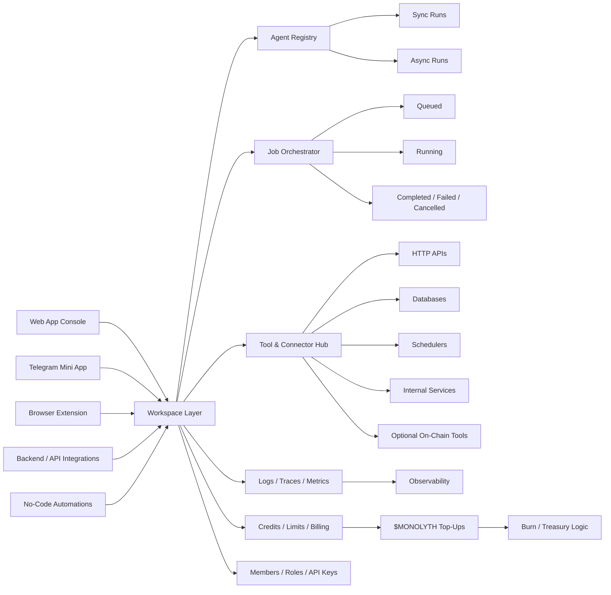
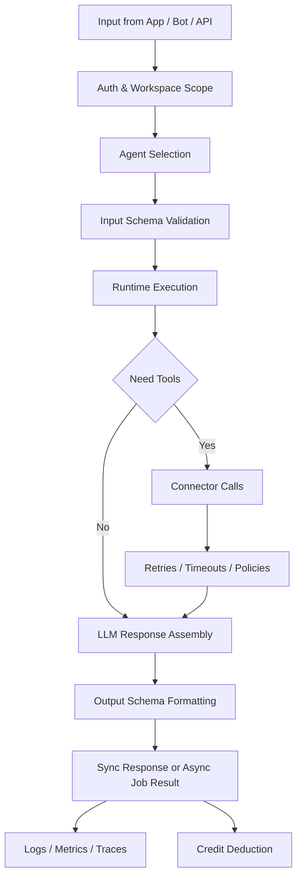
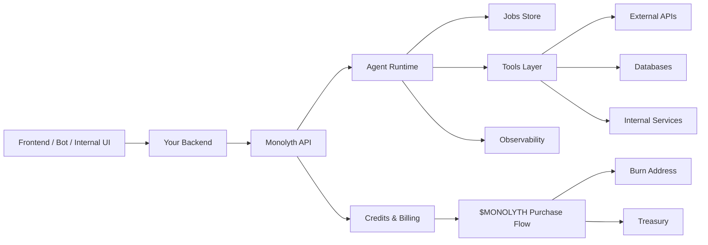

<p align="center">
  
</p>

<h1 align="center">Monolyth AI</h1>

<div align="center">
  <p><strong>Infrastructure platform for AI agents, jobs, tools, and token-powered usage</strong></p>
  <p>
    Agent orchestration • Structured outputs • Workspaces • Observability • Credits powered by $MONOLYTH
  </p>
</div>

---

> [!IMPORTANT]
> **Monolyth is infrastructure, not just a chat UI**
>  
> Monolyth is designed as a backend layer for AI agents. Your apps, bots, dashboards, and automations call Monolyth through HTTP, while Monolyth handles execution, retries, job tracking, and monitoring

### 🚀 Quick Links

[](https://your-web-app-link.com)

[](https://t.me/your_mini_app)

[](https://your-docs-link.com)

[](https://x.com/your_account)

[](https://t.me/your_group_or_channel)

---

## System Definition

Monolyth AI is a unified backend for AI agents. It gives products one place to define agent behavior, connect tools and data sources, execute jobs, observe outcomes, and control cost through a credit system tied to **$MONOLYTH**

Instead of every product building its own prompt layer, retry logic, tool orchestration, job queue, and monitoring stack, Monolyth centralizes those responsibilities into one operational system with a clean API surface

> [!TIP]
> **Best fit**
>  
> Use Monolyth when you need structured agent execution, reusable tools, predictable job handling, and a system you can plug into apps, bots, internal dashboards, or no-code flows

---

## Product View

Monolyth is one shared workspace with multiple access surfaces, execution layers, and control paths around it



The platform is structured so every surface can talk to the same workspace while preserving a consistent model for agents, tools, jobs, permissions, and billing. This keeps product logic stable across web, bot, extension, and backend use cases instead of scattering AI behavior into separate one-off implementations

---

## Operational Flow

A typical Monolyth cycle starts with an app, bot, or backend sending a request to an agent. The request is validated against the agent input schema, routed through the runtime, enriched by allowed tools if needed, and returned as a structured result or tracked as an async job



This flow is what makes Monolyth closer to infrastructure than to a default bot. The value is not only in generation, but in how runs are validated, executed, observed, and priced

> [!NOTE]
> **Sync and async modes are both native**
>  
> Short tasks can return immediately, while heavier workflows can run as tracked jobs with polling or webhook delivery

---

## Core Engines

Monolyth is easier to understand when split into a few operating layers rather than treated as one abstract AI product

| Engine | Role in the system | Why it matters |
|---|---|---|
| Agent Registry | Stores agent identity, instructions, schemas, tools, and versions | Makes agents reusable and controllable |
| Runtime & Orchestration | Executes runs, handles tool calls, retries, and policies | Turns prompts into operational workflows |
| Jobs Layer | Tracks lifecycle from pending to terminal state | Gives visibility, debugging, and async reliability |
| Tools & Connectors | Connects agents to APIs, databases, schedulers, and internal services | Lets agents act on real systems |
| Workspace Control | Isolates keys, logs, members, and limits per workspace | Keeps products and teams separated |
| Observability Layer | Collects metrics, traces, logs, failures, and execution timing | Makes production behavior inspectable |
| Credits & Token Layer | Measures usage and ties top-ups to $MONOLYTH | Connects workloads to platform economics |

These engines work together as a system. Agents define intent, tools provide capability, jobs provide lifecycle, observability provides trust, and credits provide a predictable operating model

---

## Control Surface

Monolyth exposes several control points so teams can tune behavior without rebuilding the system every time requirements change

| Control area | Examples |
|---|---|
| Agent behavior | Instructions, role, tone, constraints, failure handling |
| Input / output contracts | Typed input schemas and structured JSON output schemas |
| Tool permissions | Which connectors and tools an agent may call |
| Runtime settings | Model choice, token budget, timeout, sync or async mode |
| Access control | Workspace roles, API keys, environment split |
| Billing controls | Credits, plan limits, top-ups, consumption visibility |
| Delivery model | Polling, webhooks, internal dashboards, bot integrations |

This matters because stable systems do not come from bigger prompts alone. They come from having explicit controls over execution, permissions, interfaces, and cost

> [!WARNING]
> **Do not treat agents as unmanaged black boxes**
>  
> Monolyth is strongest when output schemas, tool boundaries, and runtime limits are defined clearly. Loose agent design leads to weaker observability and less reliable product behavior

---

## Usage Tiers

Monolyth follows a credit-based model that scales from experimentation to production deployment

### Basic

Basic usage is the fastest entry point for prototypes, internal demos, and early validation. A small workspace, a few agents, light HTTP usage, and console testing are enough to prove whether your flow works before productizing it further

| Scope | Typical fit |
|---|---|
| Personal workspace | Solo builders and first experiments |
| Limited agents | Early workflows and simple assistants |
| Light credits | Console testing and dev calls |
| Basic logs | Initial debugging and iteration |

### Advanced

Advanced usage begins when agents become part of a real product flow. At this stage, teams usually define cleaner schemas, attach more meaningful tools, split environments more carefully, and start relying on traces, metrics, and structured jobs rather than manual testing

### Production

Production usage is where Monolyth becomes operational infrastructure. Agents are versioned, environments are isolated, failures are monitored, webhook flows are enabled, and jobs are governed by reliability rules instead of best-effort execution

> [!CAUTION]
> **Realistic production expectation**
>  
> Agent systems still require clear schemas, careful tool contracts, timeout design, and monitoring discipline. Monolyth reduces orchestration complexity, but it does not remove the need for product judgment and operational ownership

---

## Architecture Notes

Monolyth is designed around a workspace-centric topology. Each workspace contains its own agents, keys, tools, logs, webhooks, and credit usage. This makes it easier to separate personal experiments from client systems, and development traffic from production traffic

A common deployment pattern looks like this:

- user-facing product or bot on the edge
- backend or automation layer as the secure caller
- Monolyth as the agent execution backend
- external tools and services behind controlled connectors
- observability and billing attached to the workspace lifecycle



This model keeps secrets and execution control on the server side while still allowing products to expose fast AI features to users

---

## Reality Check

Monolyth is not presented as magic. It is a practical system for shipping AI agents with better control, stronger observability, and cleaner integration patterns than ad-hoc bots

| Area | Realistic expectation |
|---|---|
| Speed | Sync runs are good for short tasks, async jobs are safer for heavy workflows |
| Reliability | Retries and timeouts help, but bad tool contracts still fail |
| Cost | Short jobs stay cheap, long multi-tool runs cost more credits |
| Scale | Centralization improves reuse, but production still needs rate limits and monitoring |
| Quality | Structured schemas improve downstream usage, but agent design still matters |

That balance is important. Monolyth can remove repeated engineering effort around orchestration, but it should still be treated like infrastructure that needs ownership, versioning, and measurement

---

## Run / Deploy

For local or early-stage testing, teams usually create a workspace, issue an API key, define an agent, and call it through the invocation API. For real deployment, the standard path is to keep Monolyth behind your backend or automation layer so API keys, policies, and execution routing stay under your control

### Quick local example

```bash
curl -X POST https://api.monolyth.ai/v1/agents/run \
  -H "Authorization: Bearer YOUR_API_KEY" \
  -H "Content-Type: application/json" \
  -d '{
    "agent_id": "agent_123",
    "input": {
      "question": "Summarize this ticket"
    },
    "sync": true
  }'
```

### Example response

```json
{
  "result": {
    "answer": "Monolyth returns structured agent results through a controlled runtime",
    "labels": ["summary", "infra"],
    "next_step": "Store the response in your app or continue the workflow"
  },
  "usage": {
    "prompt_tokens": 120,
    "completion_tokens": 80,
    "total_tokens": 200
  },
  "metadata": {
    "agent_version": "1.0.0",
    "request_id": "req_abc123",
    "execution_time": 1.23
  }
}
```

For production environments, a better pattern is to use async runs for heavier tasks, webhook subscriptions for completion events, and separate workspaces or environment boundaries for dev and prod traffic

---

## Credit Logic

Monolyth uses credits as the platform-level unit of usage. Credits can be included in plans or topped up, and when token billing is enabled, credit purchases are made with **$MONOLYTH**

| Mechanic | Description |
|---|---|
| Credit consumption | Charged when a job performs real work |
| Billing model | Monthly plan allocation plus optional top-ups |
| Token utility | $MONOLYTH is used to buy workspace credits |
| Burn / treasury logic | Example model: 80% burned, 20% sent to treasury |
| Transparency | Public dashboards can show burn history and treasury flows |

This gives the platform a direct link between real workloads and token demand rather than treating token utility as a cosmetic layer

> [!IMPORTANT]
> **Usage is tied to real workloads**
>  
> Credits are not abstract points with no system meaning. They are the operational meter for agent runs, and when purchased with $MONOLYTH they connect execution volume to on-chain economics

---

## Why Monolyth Instead of Default Bots

Default bots are good when a team only needs a simple chat layer. Monolyth becomes more valuable when the system needs typed outputs, shared tools, jobs, workspace isolation, and operational visibility

| Default bots | Monolyth |
|---|---|
| Mostly chat-first | Backend-first |
| Free-form text output | Structured JSON output |
| Prompt logic scattered per bot | Centralized agent and runtime logic |
| Weak lifecycle handling | Native job lifecycle and status tracking |
| Limited observability | Logs, traces, metrics, and cost visibility |
| No native tokenized billing model | Credits and optional $MONOLYTH top-ups |

That distinction should stay clear in the README because it explains the category Monolyth belongs to and prevents the product from being read as just another wrapper around a model API

---

## Closing View

Monolyth AI is best understood as a control layer for agent-based systems. It gives teams a single operational surface for defining agents, wiring tools, executing jobs, observing outcomes, and linking usage to a transparent credit model powered by **$MONOLYTH**

It is not trying to replace your product. It is the runtime backbone your product can build on top of
